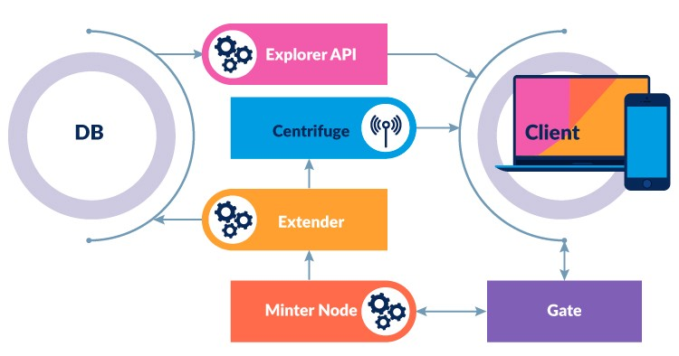

    
    
    

# Minter Explorer Extender

The official repository of Minter Explorer Extender service.

Extender is a service responsible for seeding the database from the blockchain network. Part of the Minter Explorer service.

_NOTE: This project in active development stage so feel free to send us questions, issues, and wishes_

## Related services:
- [explorer-gate](https://github.com/MinterTeam/explorer-gate)
- [explorer-api](https://github.com/MinterTeam/minter-explorer-api)
- [explorer-validators](https://github.com/MinterTeam/minter-explorer-validators) - API for validators meta
- [explorer-tools](https://github.com/MinterTeam/minter-explorer-tools) - common packages
- [explorer-genesis-uploader](https://github.com/MinterTeam/explorer-genesis-uploader)

## BUILD

- run `go mod download`

- run `go build -o ./builds/extender ./cmd/extender.go`

## USE

### Requirement

- PostgresSQL

- Centrifugo (WebSocket server) [GitHub](https://github.com/centrifugal/centrifugo)

### Setup

- use database migration from `database` directory

- build and move the compiled file to the directory e.g. `/opt/minter/extender`

- copy .env.prod to .env file in extender's directory and fill with own values

- build and run [explorer-genesis-uploader](https://github.com/MinterTeam/explorer-genesis-uploader) to fill data from genesis file (you can use the same config file for both services)

#### Run

./extender
